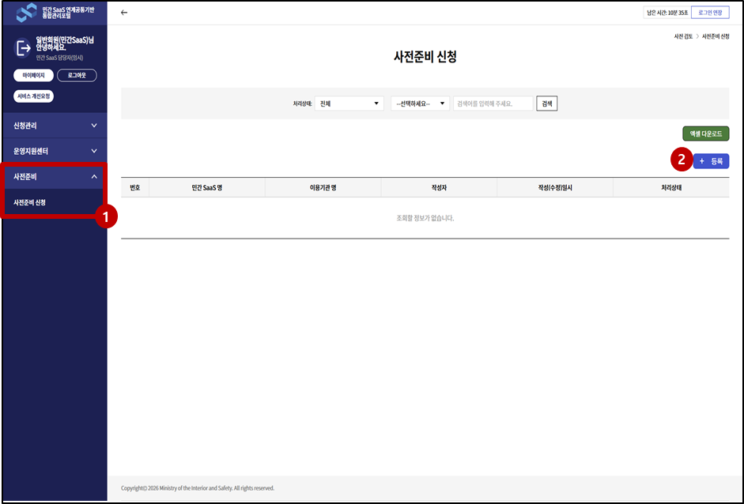
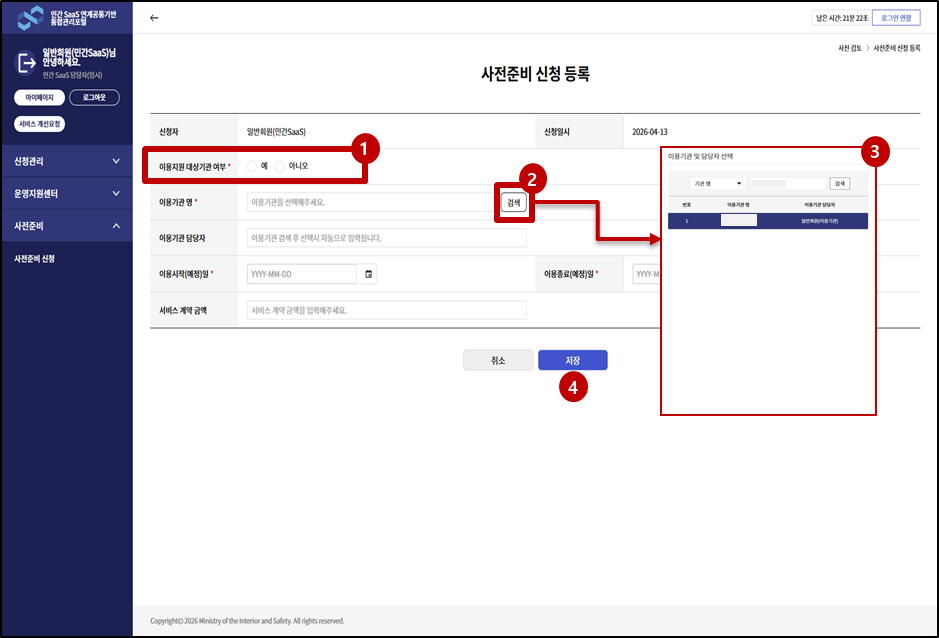
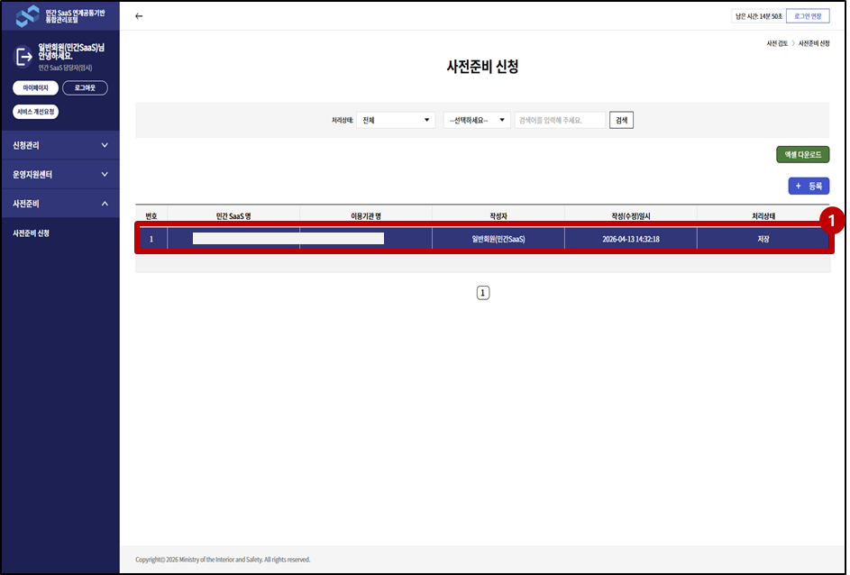
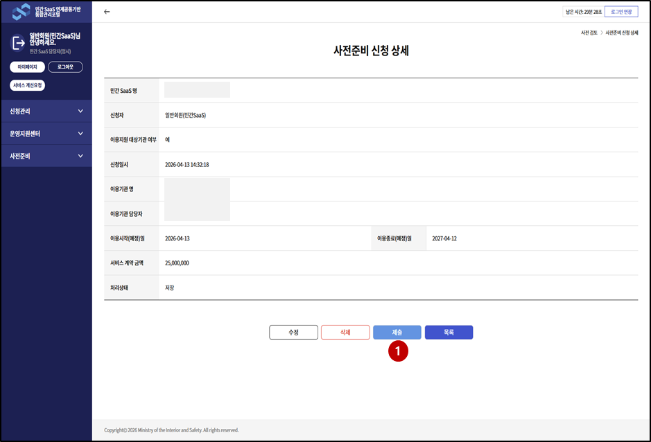
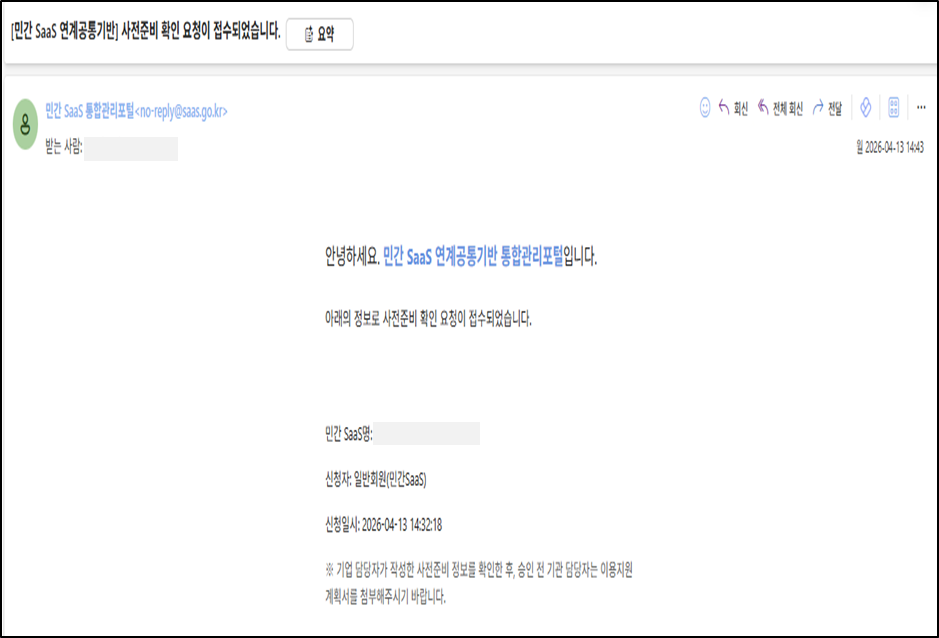
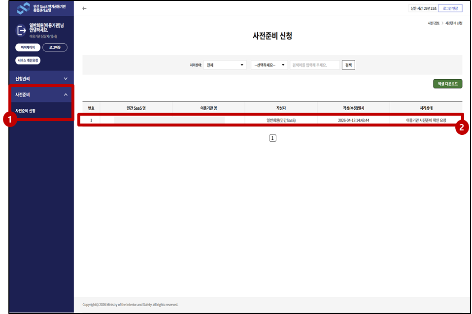
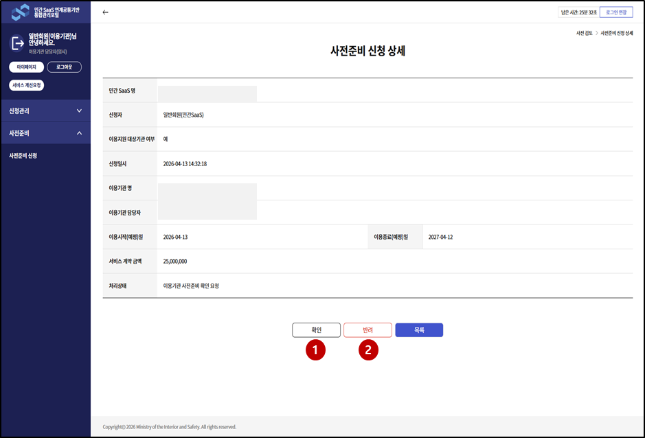
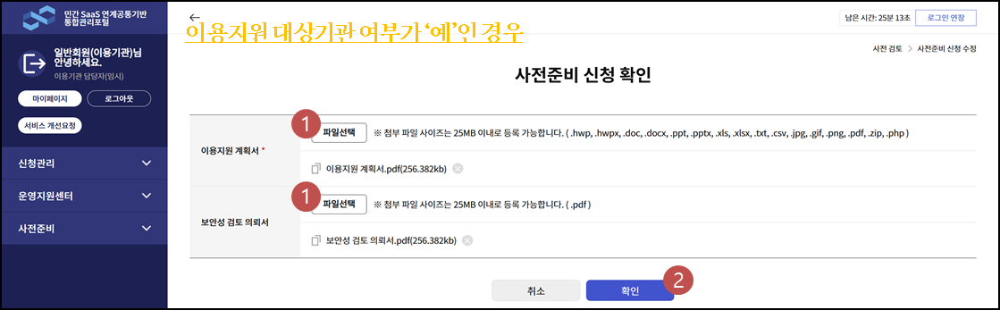
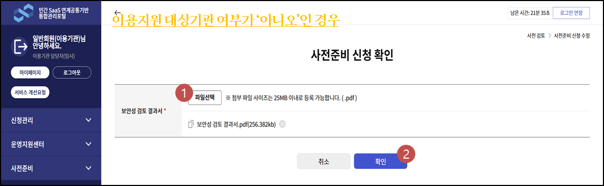

# 사전준비 신청 가이드
- 본 단계는 민간SaaS 담당자, 이용기관 담당자 모두 회원가입이 완료된 상태에서 진행해야 하는 절차입니다.

### 1-1 [민간 SaaS 담당자] 가 접속하여 사전준비 신청 페이지로 이동합니다.

① '사전준비 신청' 메뉴를 클릭하여 페이지로 이동합니다. 
② (등록) 버튼을 클릭하여 신청서를 작성하는 페이지로 이동합니다.

### 1-2 사전준비 신청서를 등록합니다.

① 이용지원 대상기관 여부를 체크합니다.
- 사전 이용지원 사업을 신청하신 대상인 경우 '예'
- 사전 이용지원 사업을 신청하지 않은 대상인 경우 '아니오'

② 이용기관과 해당 기관의 담당자를 선택하기위해 (검색) 버튼을 누릅니다. 
③ 검색박스에서 이용기관 또는 담당자명을 선택하여 검색 후 조회된 담당자를 확인하고 더블클릭하여 선택합니다. 
④ 필수항목을 전부 입력하고 (저장) 버튼 클릭. 저장 후 자동으로 목록페이지로 이동합니다.

### 1-3 신청서 목록에서 등록한 신청서를 확인할 수 있습니다.

① 신청서 등록 후 해당 신청서의 상태는 '저장'으로 등록됩니다. 
② 등록한 게시물을 더블클릭하여 상세페이지로 이동합니다.

### 1-4 제출 버튼을 눌러 이용 신청을 완료합니다.

① 수정 / 삭제 / 제출 / 목록 버튼이 활성화되어 있습니다. 내용 확인후 (제출) 버튼을 클릭하여 이용신청을 완료합니다.

### 2. 이용기관에게 확인 요청 이메일 발송

이용기관 담당자에게 확인 요청 이메일이 발송됩니다.

### 2-1. [이용기관 담당자] 가 접속하여 사전준비 신청 페이지로 이동합니다.

① '사전준비 신청' 메뉴를 클릭하여 페이지로 이동합니다. 
② 민간 SaaS 담당자가 (1-1~4) 과정을 완료하면 목록에서 신청서를 확인하실 수 있습니다. 
- 신청서를 더블클릭하여 상세 페이지로 이동합니다.

### 2-2. 사전준비 신청서를 확인 또는 반려 처리합니다.

① (확인)버튼을 누르면 첨부파일 업로드 화면으로 이동합니다. 
② (반려)버튼을 눌러 신청서를 취소할 수 있습니다. 상태가 '이용기관 사전준비 확인 요청'에서 '반려' 상태로 바뀝니다.

### 2-3. 필요한 첨부파일을 업로드 합니다.

① (파일선택)버튼을 눌러 첨부파일을 업로드 합니다. 
- 이용지원 대상기관 여부가 '예'인 경우 이용지원 계획서는 필수값입니다.
- 이용지원 대상기관 여부가 '아니오'인 경우 보안성 검토 결과서는 필수값입니다.

② (확인)버튼을 누르면 신청상태가 '이용기관 사전준비 확인 요청'에서 '이용기관 사전준비 확인'으로 바뀝니다.  
 
 
이후 최종적으로 이용지원센터에서 신청서를 승인하거나 반려하게 됩니다. 
신청서가 반려된 경우 민간 SaaS 담당자는 '저장' 단계에서 신청서를 수정하여 다시 제출처리 하셔야 합니다.