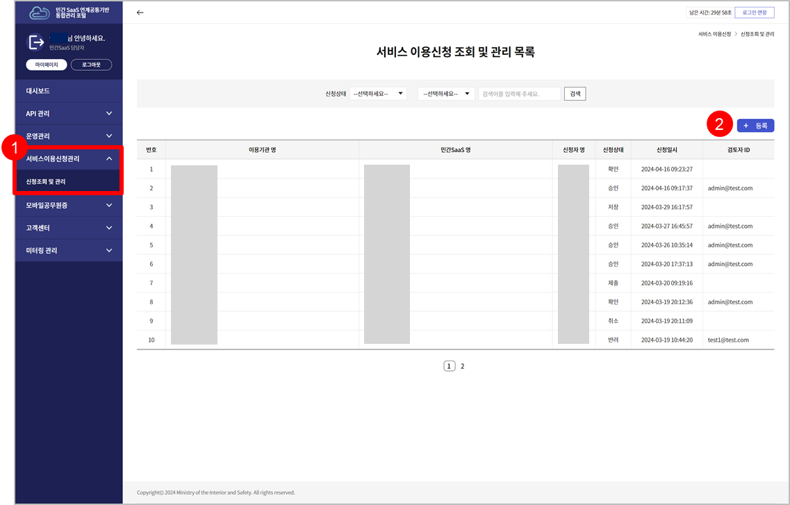
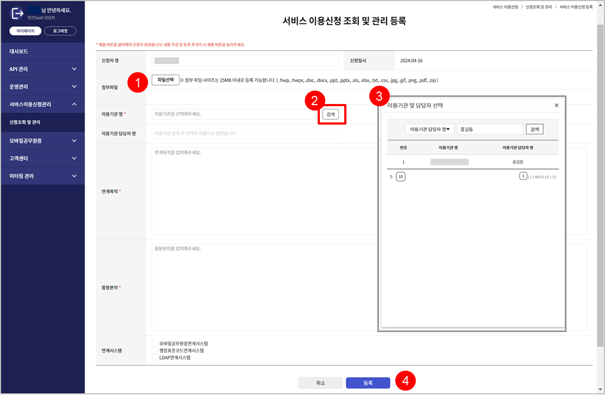
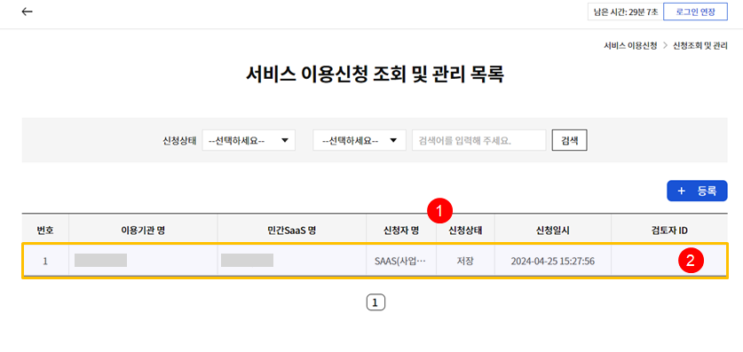
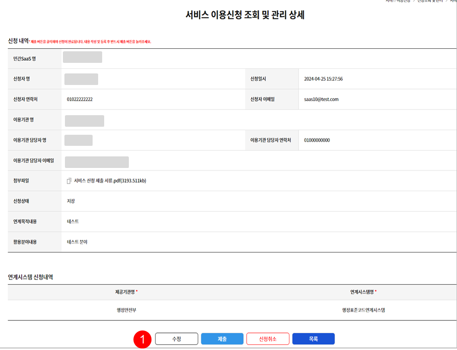
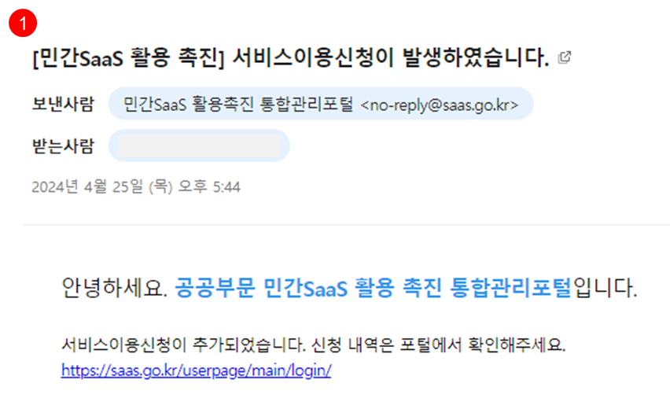
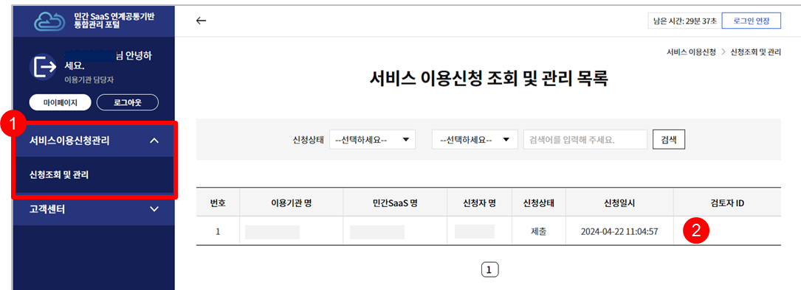
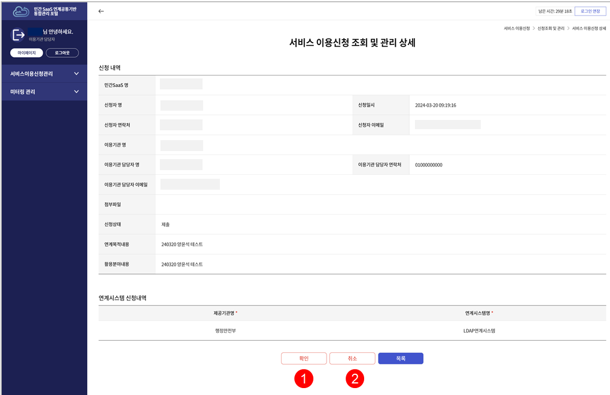

# 전자정부 연계 SaaS 서비스 신청 가이드
- 본 단계는 민간SaaS 담당자, 이용기관 담당자 모두 회원가입이 완료된 상태에서 진행해야 하는 절차입니다.

### 1-1 [민간 SaaS 담당자] 가 접속하여 서비스이용신청 조회 및 관리 페이지로 이동합니다.

① '서비스 이용신청 및 조회 및 관리 메뉴를 클릭하여 페이지를 이동합니다.
② (등록) 버튼을 클릭하여 신청서를 작성하는 페이지로 이동합니다.

### 1-2 연계 SaaS 이용 신청서를 등록합니다.

① 신청시 필요한 서류를 첨부합니다.
- 이용지원 신청서 1부
- 이용지원 계약서 및 부속 서류 1부

② 이용기관과 해당 기관의 담당자를 선택하기위해 (검색) 버튼을 누릅니다.
③ 검색박스에서 이용기관 또는 담당자명을 선택하여 검색 후 조회된 담당자를 확인하고 더블클릭하여 선택합니다.
④ 필수항목을 전부 입력하고 (등록) 버튼 클릭. 등록 후 자동으로 목록페이지로 이동합니다.

### 1-3 신청서 목록에서 등록한 신청서를 확인할 수 있습니다.

① 신청서 등록 후 해당 신청서의 상태는 '저장'으로 등록됩니다.
② 등록한 게시물을 더블클릭하여 상세페이지로 이동합니다.

### 1-4 제출 버튼을 눌러 이용 신청을 완료합니다.

① 수정 / 제출 / 신청 취소 / 목록 버튼이 활성화되어 있습니다. 내용 확인후 (제출) 버튼을 클릭하여 이용신청을 완료합니다.

### 2. 이용기관에게 확인 요청

이용기관 담당자 메일로 확인 요청 이메일이 발송됩니다.

### 2-1. [이용기관 담당자] 가 접속하여 검토 및 신청확인

① '서비스 이용신청 및 조회 및 관리 메뉴를 클릭하여 페이지를 이동합니다.
② 민간 SaaS 담당자가 (1-1~4) 과정을 완료하면 목록에서 신청서를 확인하 수 있습니다. 
- 신청서를 더블클릭하여 상세 페이지로 이동합니다.

### 2-2. [이용기관 담당자] 가 접속하여 검토 및 신청확인

① (확인)버튼을 누르면 신청서의 상태가 '제출'에서 '확인'으로 바뀝니다. 이후 최종적으로 총괄기관이 신청서를 승인하거나 반려하게 됩니다.
② (취소)버튼을 눌러 신청서를 취소할 수 있습니다. 상태가 '제출'에서 '취소' 상태로 바뀝니다.
