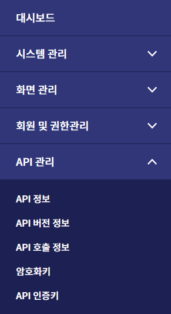

# 2. API Key 발급 및 사용 가이드

## 본 단계는 서비스 이용 신청 절차 이후, 진행해야 하는 절차입니다.

### (1) 연계서비스ID / API 인증키 / 암호화 키 확인
- 전자정부 연계 SaaS用 연계 개발 가이드 p.5의 민간 SaaS 통합 관리 포털에서 연계서비스ID, API 인증키, 암호화키 확인 필요

- 연계서비스ID 확인 방법: 로그인 -> 우측 상단의 운영 메뉴 -> API 관리 → API 인증키 → 해당 이용 서비스의 목록 선택 후 최상단의 연계서비스ID 확인
- API 인증키 확인 방법 : 로그인 -> 우측 상단의 운영 메뉴 -> API 관리 → API 인증키 → 해당 이용 서비스의 목록 선택 후 최하단의 API 인증키 값 확인
- 암호화 키 확인 방법 : 로그인 -> 우측 상단의 운영 메뉴 -> API 관리 → 암호화 키 → 해당 이용 서비스의 목록 선택 후 암호화키 값 확인
### 주의사항 : 암호화키 메뉴의 연계서비스ID와 API 인증키 목록의 연계서비스ID는 서로 동일하므로, 둘 중 임의로 하나를 사용

### (2) 복호화 키 생성
- 전자정부 연계 SaaS用 연계 개발 가이드 p.6의 데모 소스 코드의 String decryptKey = decryptApiKey("발급받은 APIkey", "암호화키"); 확인
- “발급받은 API Key”에 `(1) 연계서비스ID / API 인증키 / 암호화 키 확인` 에서 확인한 `API 인증키 값` 붙여넣기
- “암호화키”에 `(1) 연계서비스ID / API 인증키 / 암호화 키 확인` 에서 확인한 `암호화키 값` 붙여넣기
- 데모 소스 코드를 실행시킨 후, 콘솔에 출력되는 값 `복호화키 값` 을 확인

### (3) API 호출
- 전자정부 연계 SaaS用 연계 개발 가이드 p.5의 사진을 참고하여 API 요청
- Postman, hoppscotch 등 자율적으로 오픈소스 API 테스트 사이트 사용 가능
- Header의 Key와 Value에 (1), (2)에서 확인한 연계서비스 ID와 복호화키 값을 세팅
  - 호출 예) https://saas.go.kr/api/gscs/data/blood
### 주의 : 각 연계서비스별로 서로 다른 연계서비스ID / API 인증키 / 암호화 키가 발급되므로 각 서비스마다 서로 다른 연계서비스ID 확인 및 복호화키 발급 과정 필요

### (4) 테스트키 인증 확인 및 실제키 신청
- 지금까지의 과정을 통하여 테스트키 인증이 완료되었으면 실제키로 전환이 필요
- 테스트키로는 통신에 대한 성공/실패 여부만 return 하고 실제 데이터는 실제키 전환 이후 확인 가능
- 실제키로 전환을 위하여 통합관리포털의 ‘API 실제키 신청’ 메뉴에서 ‘테스트키 통신 성공 증적’을 첨부하여 실제키 신청 글 작성 필요 (각 연계 서비스 별로 서로 다른 증적 첨부)
- 실제키 신청 시, 첨부해야 할 증적 자료는 API 호출 이후 console 결과를 통한 통신 증적 (request 주소, 시간) 등을 확인하여 첨부
- 운영지원센터 담당자의 실제키 발급 신청 승인 단계를 거친 후, 통합관리포털에서 새로 발급받은 실제 연계서비스ID 및 키를 통해 (1),(2),(3)을 반복하여 실제 데이터 확인 가능
