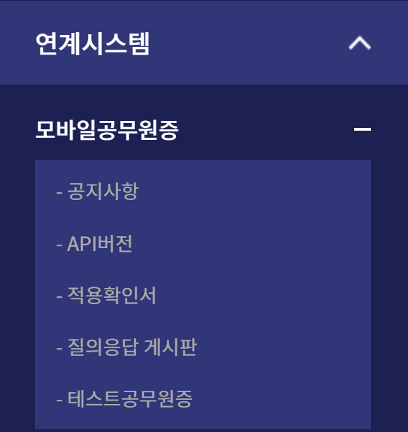
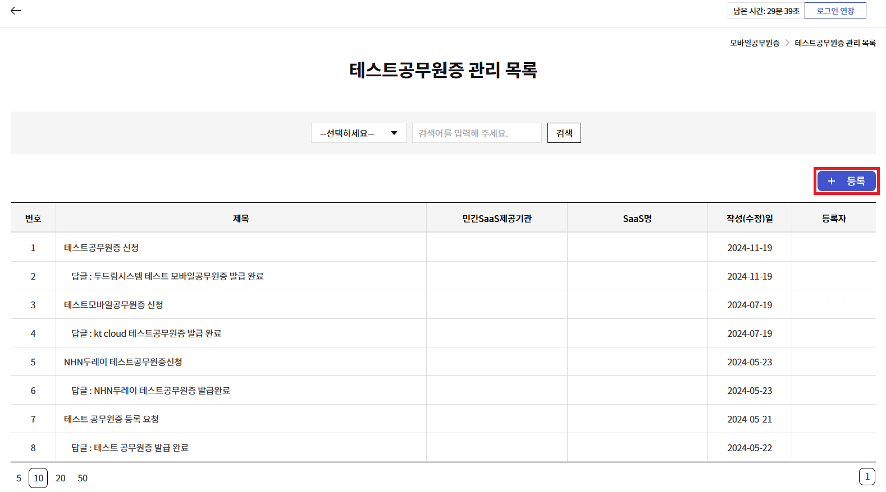

# 3. 연계 개발 기술 지원 가이드
본 단계는 API Key 발급 및 사용 절차 이후, 진행해야 하는 절차입니다.

### (1) LDAP

### (2) 행정표준코드

### (3) 모바일공무원증
#### ① 테스트 모바일공무원증 발급 신청
- 로그인 이후 운영메뉴 중 연계시스템 > 모바일공무원증 > 테스트공무원증 메뉴 선택

- 테스트공무원증 메뉴 진입 후 [등록] 버튼을 클릭하여 등록 화면으로 이동

- 테스트공무원증 등록 화면에서 각 항목 입력 후 등록
  - 제목 : 등록할 제목 입력
  - 민간 SaaS 명 : 모바일공무원증을 사용할 이용기관
  - 첨부파일 : 안내된 이메일에 첨부된 테스트 [모바일공무원증 신청 양식] 파일에 양식 기입 후 첨부
  - 내용 : 테스트공무원증 신청 완료 내용 입력
#### ② 테스트 모바일공무원증 발급 완료 및 이후 절차 안내
- 테스트 모바일공무원증 발급 완료 안내 및 개발완료 증적 가이드 안내
- 발급된 테스트공무원증으로 이용기관 시스템에 맞는 화면 및 로그인 개발 진행
- 대금지급 검수를 위한 개발완료 증적 사업단에서 검토 후 회신

### (4) GPKI(추후 예정)

