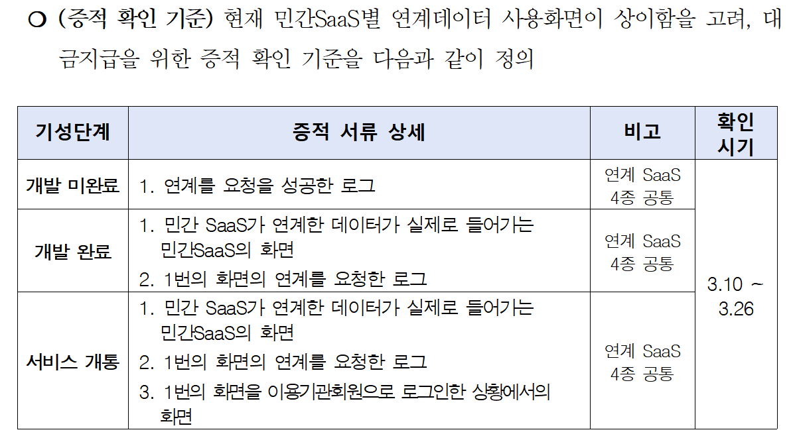

## 서비스 개통 증적

### 1. 개발 완료 기준
- postman 등을 사용하여 연계 API를 호출하여 데이터를 응답 받은 첨부 파일은 개발 미완료로 간주됩니다. 
- 연계한 데이터가 실제로 표출하고 있는 `민간 SaaS의 화면` 및 `연계를 요청한 로그`를 첨부해주셔야합니다.

### 2. 서비스 개통 기준
- `개발 완료 기준을 충족`하고 `실제로 이용기관 담당자가 볼 수 있는 화면`이 존재할 때 서비스 개통이 된 것으로 간주됩니다.

### 3. 이용지원료 지급은 개발 완료 또는 서비스 개통 증적 확인이 모두 완료된 기관/기업 순으로 이용지원금 지급 예정입니다.
